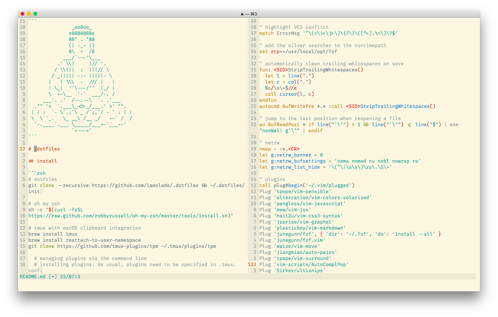

```
               _oo0oo_
              o8888888o
              88" . "88
              (| -_- |)
              0\  =  /0
            ___/`---'\___
          .' \\|     |// '.
         / \\|||  :  |||// \
        / _||||| -:- |||||- \
       |   | \\\  -  /// |   |
       | \_|  ''\---/''  |_/ |
       \  .-\__  '-'  ___/-. /
     ___'. .'  /--.--\  `. .'___
  ."" '<  `.___\_<|>_/___.' >' "".
 | | :  `- \`.;`\ _ /`;.`/ - ` : | |
 \  \ `_.   \_ __\ /__ _/   .-` /  /
  `-.____`.___ \_____/___.-`___.-'
               `=---='
```

# .dotfiles



## install

```zsh
# instal brew
/usr/bin/ruby -e "$(curl -fsSL https://raw.githubusercontent.com/Homebrew/install/master/install)"

# node, fzf
brew install node
brew install fzf

# oh my zsh
sh -c "$(curl -fsSL https://raw.github.com/robbyrussell/oh-my-zsh/master/tools/install.sh)"

# dotfiles
git clone --recursive https://github.com/iamvlado/.dotfiles && ~/.dotfiles/init

# vim-plug — a minimalist vim plugin manager
curl -fLo ~/.vim/autoload/plug.vim --create-dirs https://raw.githubusercontent.com/junegunn/vim-plug/master/plug.vim

# vim :PlugInstal

# restart terminal.app

# tmux with macOS clipboard integration
brew install tmux
brew install reattach-to-user-namespace
git clone https://github.com/tmux-plugins/tpm ~/.tmux/plugins/tpm

  # managing plugins via the command line
  # installing plugins. As usual, plugins need to be specified in .tmux.conf.
  # run the following command to install plugins:
  ~/.tmux/plugins/tpm/bin/install_plugins

  # updating plugins
  ~/.tmux/plugins/tpm/bin/update_plugins all

  # or update a single plugin
  ~/.tmux/plugins/tpm/bin/update_plugins tmux-sensible

  # removing plugins
  ~/.tmux/plugins/tpm/bin/clean_plugins
```

## font
+ [firacode](https://github.com/tonsky/FiraCode) — monospaced font with programming ligatures

## cli
+ [trash](https://github.com/sindresorhus/trash-cli) — move files and folders to the trash

## macos apps
+ [amphetamine](https://itunes.apple.com/app/amphetamine/id937984704?mt=12) — you can effortlessly override your energy saver settings and keep your mac awake
+ [appcleaner](https://freemacsoft.net/appcleaner/) — which allows you to thoroughly uninstall unwanted apps
+ [spectacleapp](https://www.spectacleapp.com) — move and resize windows with ease
+ [transmission](https://transmissionbt.com/download/) — a fast, easy, and free bittorrent client
+ [tunnelblick](https://tunnelblick.net/downloads.html) — is a free, open source graphic user interface for OpenVPN®

## gmail
+ [gmail setup](https://iamstarkov.com/gmail-setup/) — gmail is not very friendly by default
+ [keyboard shortcuts](https://support.google.com/mail/answer/6594?hl=en) — save time navigating in gmail by using keyboard shortcuts

## macos useful productivity hacks
+ hit `command-b` to open a new tab in your default browser using your default search engine
+ in finder, press `shift+cmd+.` to toggle hidden files

## must read
+ [fabulous macos tips & tricks](https://blog.sindresorhus.com/macos-tips-tricks-13046cf377f8#.akgfqk1uo)
